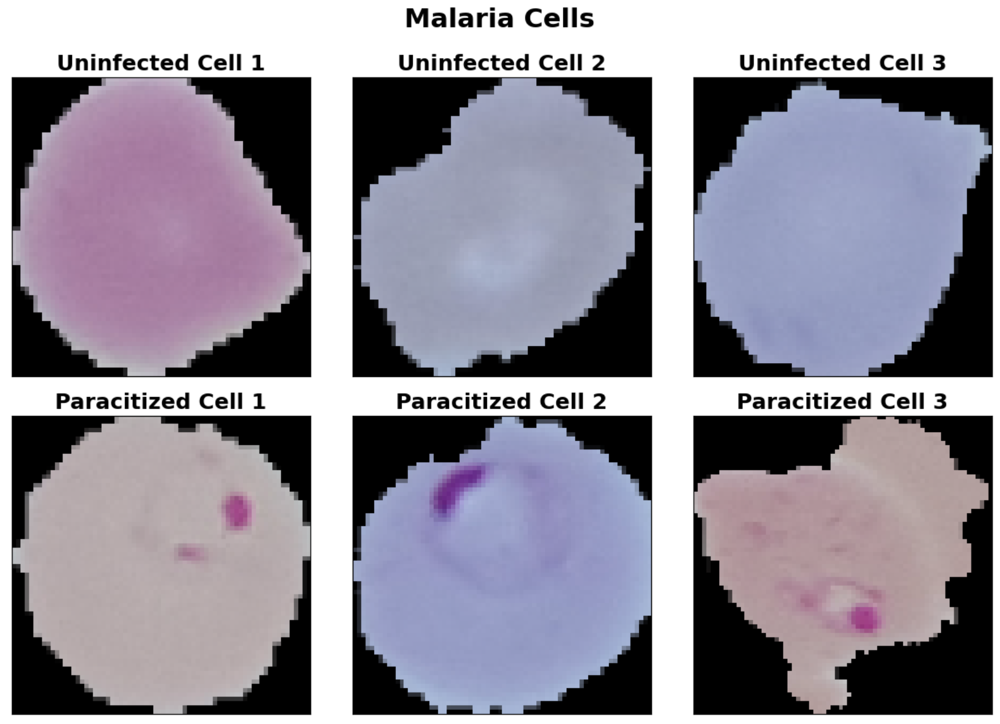
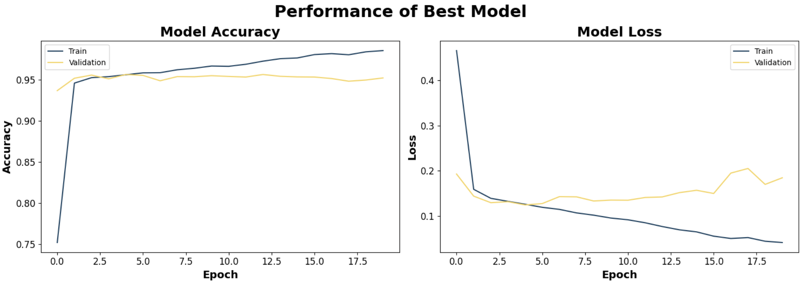
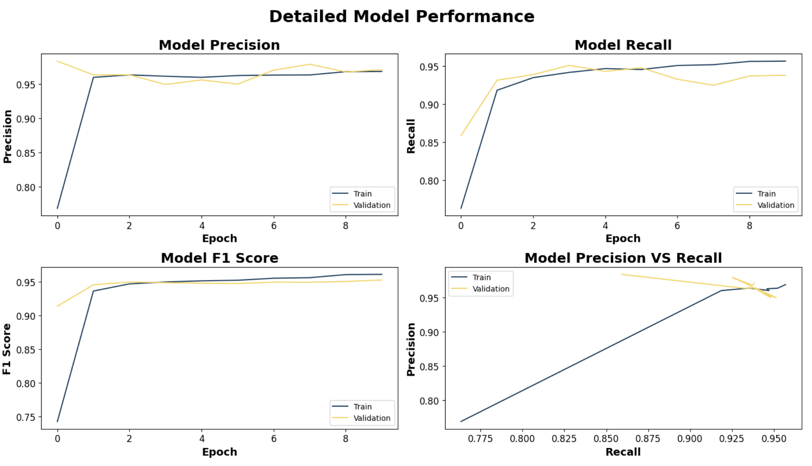

# Deep Learning Malaria Cell Image Classification

- Trained multi-layered convolutional neural network (CNN) to detect malaria in 25,000+ human cells
- Performed data augmentation to increase dataset size by 300% and reduce overfitting
- Determined best model architecture with 96% validation accuracy and F1 score of 0.95

## Code and Resources Used

**Python Version:** 3.8.12\
**Installations:** keras-tuner
**Packages:** tensorflow, keras, sklearn, pandas, numpy, matplotlib, os, cv2, glob\
**Source Code:** https://www.kaggle.com/datasets/iarunava/cell-images-for-detecting-malaria

## Data Collection

The data was sourced from a Kaggle dataset, which I then uploaded and imported to Google Drive.

The dataset wast taken from the official NIH Website, consisting of malaria _paracitized_ cells and _uninfected_ human cells. There were a total of 27,558 images, split evenly among classes the paracitized and uninfected classes (13,779 in each).

## Data Preparation

The cells were loaded and resized to dimensions of 70x70 pixels and converted to grayscale for more accuracy predictions.

## EDA

Three cells from each class were randomly selected and plotted to distinguish how exactly the _paracitized_ cells with malaria differed from the _uninfected_ human cells. Here is what I found:

  

From first glance, it's interesting to see that paracitized cells have certain globs of shades of pink/purple, which indicate that presence of malaria. However, overall color of the cell itself doesn't seem to indicate the presence of malaria.

## Build Baseline Neural Networks

To understand the nature of the dataset, I built two baseline neural networks. The first network consisted of 2 Dense layers of 512 nodes in one and 256 nodes in the other, with an output layer. The other was a baseline Convolution classifier, that consisted of a 2D Covolution layer with 32 nodes and a kernel size of 3 as well as a 2D MaxPooling layer, with an output layer. ReLU activation was used for each layer in both models, expect for the output layers. The output layers were Dense layers with 1 node with the Sigmoid activation function.

Each model used the Adam optimization algorithm with binary cross-entropy loss. This was great for handling sparse gradients and noisy datasets.

## Data Augmentation

To account for overfitting, I performed data augmentation to artificially increase the size of the training data. The following augmentations on each image were performend:
- Horizontal flip
- Rotation of factor 0.1x
- Zoom of factor 0.1x

This resulted in a dataset 4x the size of the original training set, and acted as a measure of reducing model overfitting.

## Determine Best Neural Network Architecture

To programatically find the best model architecture, I used keras-tuner's RandomSearch and prioritized the validation set accuracy. Because the Convolution Neural Network performed the best in terms of baseline models, it was a good place to start.

It consisted of hyperparameter tuning over the following model combinations:
- 0 to 3 Convolution layers, each with either 16, 32, 64, 128, 512, or 1024 nodes
- 0 to 3 Dense layers, each with either 16, 32, 64, 128, 512, or 1024 nodes
- Combination of Dropout, Flatten, MaxPooling2D layers, Dense output layer

I performed this tuning two separate times: one without the augmented data, and one with the augmented data.

The best model was determined with the highest validation accuracy and is as follows:
- Sequential (input)
- 2D Convolution: 16 nodes, kernal size of 3, ReLU activation function
- 2D MaxPooling: 2x2 pool size
- 2D Convolution: 32 nodes, kernal size of 3, ReLU activation function
- 2D MaxPooling: 2x2 pool size
- 2D Convolution: 1024 nodes, kernal size of 3, ReLU activation function
- Dropout: 50%
- Flatten
- Dense: 16 nodes, ReLU activation function
- Dense (output): 1 node, Sigmoid activation function

## Model Evaluation

Each network was evaluated using a random selection of 20% of the training data through the use of the _validation_split_ parameter when fitting the model.

The performances for each of the models is as follows:

| Model                        | Val Accuracy |
| ---------------------------- | ------------ |
| Base Dense network           | 0.6685       |
| Base CNN                     | 0.8306       |
| Tuned CNN w/o augmented data | 0.9563       |
| Tuned CNN w/ augmented data  | 0.9392       |

The tuned models performed much better than the baseline models, with the best model being the tuned convolution neural network without auagmented data, with an accuracy with 95.63%. This is better visualized below:

  

## A Note on Precision, Recall, and F1 Score

Accuracy isn't usually the most appropriate evaluation metric for classifiers, specifically due to imbalanced classes. Hence, precision, recall, and f1 score, as well as AUC, are supplemental evaluators to account for such, as they take into account sensitivity and specificity rates.

However, this dataset was completed balanced between classes, so accurcy is a great metric to evaluatae the performance of the neural networks. Nonetheless, the other metrics are as follow:

| Metric    | Value  |
| --------- | ------ |
| Loss      | 0.1430 |
| Precision | 0.9711 |
| Recall    | 0.9382 |
| F1 Score  | 0.9529 |

Both the precision and recall are very strong, indicating low numbers of false positives and false negatives. Likewise, the F1 Score is near 1, and acts as a weighted average of both precision and recall. This indicates a very good convolution neural network, nearly perfectly classifying each cell to its respective class.

The detailed model performance is as follows:

  

## Considerations Going Forward

Because false negatives could be dangerous (classifying a cell as uninfected when it is in fact paracitized), models could be improved to add a threshold when classifying to limit the number of false negatives. This would, in turn, increse the number of false positives, but a Type I Error is much less detrimental than a Type II Error, in this scenario.

